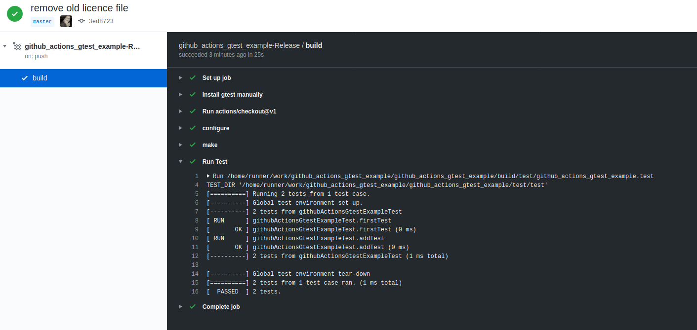
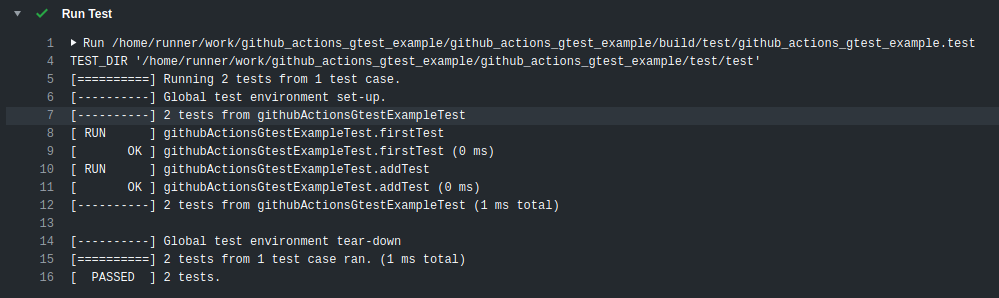
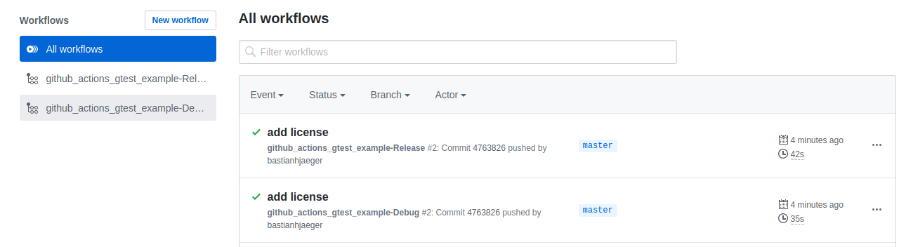

# General


Example on how to integrate gtest test into [github actions](https://github.com/features/actions).


While there exist other links in the www on how to use it (which did not work for my setup), this repo quickly shows how to add a workflow / action to github that executes your gtest tests and responses with a simple ok / not-ok to highlight on github.

It is plain and simple, but maybe it helps you.

# Setup Actions

the workflow file you need (e.g. in you repo under `.github/workflows/release.yml`) could look like this

```yaml
name: my-workflow-name

on:
  push:
    branches: [ master ]
  pull_request:
    branches: [ master ]

jobs:
  build:
    runs-on: ubuntu-latest
    steps:
    - name: Download, configure and install gtest
      run: |
        wget https://github.com/google/googletest/archive/release-1.10.0.tar.gz
        tar xf release-1.10.0.tar.gz
        cd googletest-release-1.10.0
        cmake -DBUILD_SHARED_LIBS=OFF .
        sudo make install
    - name: Checkout the project
      uses: actions/checkout@v1
    - name: Do some tests
      run: |
        mkdir build
        cd build
        cmake -DCMAKE_BUILD_TYPE=Release -DCMAKE_CXX_FLAGS="-Werror" ..
        make
        /home/runner/work/github_actions_gtest_example/github_actions_gtest_example/build/test/github_actions_gtest_example.test
 ```

The important part is the *"Download, configure and install gtest"* section. This is the plain and simple way to add it.

# Result

After some time (depending on you project and test complexity) you see the results like this:








# Build local
```bash
git clone git@github.com:bastianhjaeger/github_actions_gtest_example.git
cd github_actions_gtest_example
mkdir build && cd build
cmake -DCMAKE_BUILD_TYPE=Release ..
make -j8
```

# If you only want to use Makefile

You can use :
- `pkg-config --cflags gtest gmock` for your CXXFLAGS.
- `pkg-config --libs gtest gmock` for your LDFLAGS.
